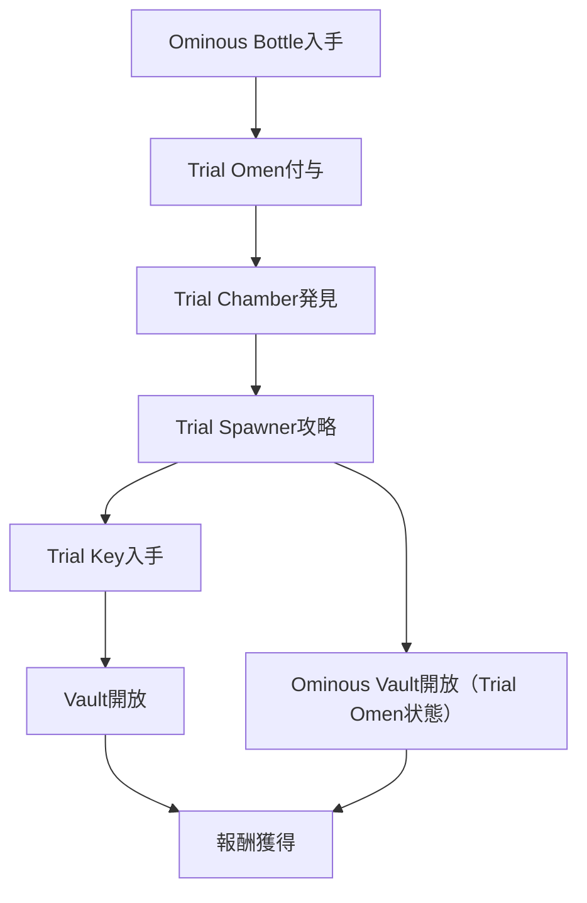

# Tricky Trials（2024-06-13）

## 概要

- アップデートは Java 1.21 / BE 1.21.0 である。
- 主な新要素は Trial Chambers, Trial Spawner, Vault, Ominous Vault, Breeze, Bogged, Mace, Breeze Rod, Wind Charge, Heavy Core, 新銅・Tuff ブロック, Crafter, Ominous Bottle, Trial Key, Explorer Map, 新ポーション、新絵画である。

フロー

### 0. Ominous Bottle を入手する方法

- ピリジャーの隊長（襲撃に参加していない状態）を倒すと必ず 1 個ドロップする（レベル I ～ V、ランダム）。
- Trial Chamber 内の Vault や報酬チェストからも低確率で入手できる。

### 1. Trial Omen（不吉な兆し）を得る

- Ominous Bottle を飲むと Bad Omen 効果（100 分間）を得られる。
  - 既に Bad Omen が付与されている場合、より高レベルの Ominous Bottle を飲むと効果が上書きされる。
- Trial Chamber 内で Bad Omen 状態になると Trial Omen に変化し、Trial Spawner が「不吉な」状態になる。

### 2. Trial Chamber を発見する

- 地下深くに生成される構造物であり、Tuff や銅ブロックで構成されている。
- Cartographer（製図家）との取引で Trial Chamber 用の Explorer Map を入手し、座標を特定できる。

### 3. Trial Spawner を攻略する

- Trial Spawner から Breeze や Bogged などの新モブが出現する。
- 全て撃破すると Trial Key がドロップする。

### 4. Vault/Ominous Vault を解放する

- Trial Key で Vault を開けて報酬を獲得できる。
- Ominous Vault は Trial Omen 状態でのみ解放でき、中身はより豪華である。

## 新要素の入手・レシピ

- **Mace**: Heavy Core と Breeze Rod でクラフトできる。
- **Crafter**: Tuff、Redstone Dust、Iron Ingot でクラフトできる。
- **Trial Key**: Trial Spawner 攻略時にドロップする。
- **Ominous Bottle**: Trial Chamber 内やチェストで入手できる。

## 進行チャート

## 注意点・補足

- Trial Chamber は地下深くに生成される。
- Trial Omen は一定時間で消失するため、Ominous Vault の解放は迅速に行う必要がある。
- Breeze は風攻撃、Bogged は毒矢攻撃を行うため、装備を整えて挑戦するとよい。
- 新ブロックや絵画、ポーションは Trial Chamber や Vault 報酬で入手できる。

## 参考

- [Minecraft Wiki: Trial Chambers](https://minecraft.wiki/w/Trial_Chamber) を参照するとよい。
- [公式 Changelog](https://aka.ms/MCChangelogs)
