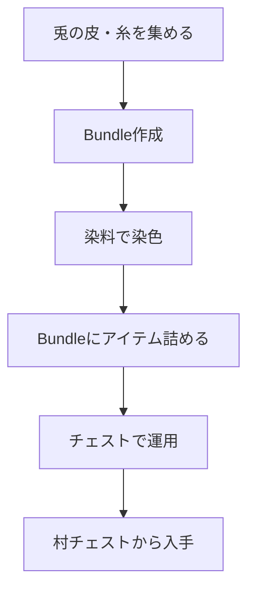

# Bundles of Bravery（2024-10-22）

## 概要

- アップデートは Java 1.21.2 / BE 1.21.40 である。
- 主な新要素は Bundle（アイテム圧縮用）、Bedrock Hardcore モードである。

フロー

1. **Bundle を作成する**
   - 兎の皮 6 枚と糸 2 本でクラフトできる。
2. **Bundle を染色する**
   - 染料と Bundle をクラフトして色付き Bundle を作成できる。
3. **Bundle の運用を確認する**
   - Bundle に複数種類のアイテムを詰めることができる。
   - チェストや村のチェストから Bundle を入手できる。
   - Bundle をチェストに収納したり取り出したりできる。
4. **Bedrock Hardcore を体験する（BE のみ）**
   - BE で Hardcore モードを選択し、1 ライフでのサバイバルを体験できる。

## 進行チャート

## 注意点・補足

- Bundle は最大 64 個分のアイテムを混在して格納できる。
- Java 版と BE 版で挙動や入手方法が異なる場合がある。
- BE の Hardcore は Realms にも対応している。

---

### 【新要素詳細】Bundle（バンドル）

Bundle は、最大 64 個分の様々なアイテムを 1 スロットにまとめて持ち運べる便利な収納アイテムである。中身はインベントリ画面で個別に出し入れでき、染料で 16 色に染めることもできる。

#### 入手方法

- クラフトは革 1 枚と糸 1 本で作成できる（染色は任意のバンドルと染料で可能である）。
- 村の各種チェスト（砂漠、平原、雪原、サバンナ、タイガ、武器鍛冶、製図家、なめし革職人）からも低確率で入手できる。

#### 使い方

- バンドルを持ってアイテムをクリックすると収納でき、右クリックで中身を 1 つずつ取り出せる。
- 収納できる量はアイテムごとに異なり、スタック数が少ないものほど多く容量を消費する（例：棒は 1/64、エンダーパールは 1/16、非スタックアイテムは全容量を消費する）。
- バンドルの中にさらにバンドルを入れることもできる（ただし 1/16 容量消費、中身分も消費する）。
- シュルカーボックスはバンドルに入れられないが、逆は可能である。

#### 注意点

- Java 版と BE 版で操作方法や仕様が一部異なる。
- バンドルを破壊すると中身がドロップする。
- 染色は 16 色のみであり、レザー装備のような自由な色混ぜはできない。

詳しくは [Minecraft Wiki: Bundle](https://minecraft.wiki/w/Bundle) を参照するとよい。

## 参考

- [Minecraft Wiki: Bundle](https://minecraft.wiki/w/Bundle)
- [公式 Changelog](https://aka.ms/MCChangelogs)
