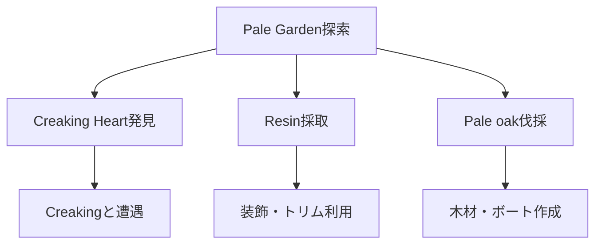

## 概要

- アップデートは Java 1.21.4 / BE 1.21.50 である。
- 主な新要素は Pale Garden バイオーム、Creaking（新 mob）、Creaking Heart、Pale oak 系木材、Pale Hanging Moss、Eyeblossom、Resin 系ブロック、Pale oak boat である。

## Pale Garden バイオームの特徴と探し方

- 「Pale Garden」はダークフォレストの亜種であり、主に山岳地帯やダークフォレスト隣接地に稀に生成される非常にレアなバイオームである。
- 主な構成ブロックは Pale Oak（淡い色のオーク）、Pale Moss Block/Carpet、Eyeblossom、Pale Hanging Moss などである。
- 水や空、草、葉の色が全体的に淡く、霧がかかる（特に Vibrant Visuals 有効時）。
- ウッドランドマンションが生成されることもある。
- 音楽は流れず、入ると BGM がフェードアウトする。

### 出現 mob

- 夜間は Creaking（新 mob）が Creaking Heart からスポーンする。
- 通常のパッシブ mob は自然スポーンしないが、敵対 mob（ゾンビ・スケルトン等）は出現する。

### Creaking Heart

- 一部の Pale Oak に 20%の確率で生成される特殊ブロックである。
- 夜間にアクティブ化し、Creaking をスポーンさせる。
- 小規模な Pale Garden では Creaking Heart が無い場合もある。

### 探索のコツ

- ダークフォレストや山岳地帯を中心に地図を広げて探すとよい。
- Eyeblossom や Pale Moss Patch など独特な植物が目印になる。

フロー

1. **Pale Garden バイオームを発見し、特徴を観察する**
   - 上記の特徴を参考に、バイオームを見つけて景観や植生を観察するとよい。
2. **Creaking Heart を探し、夜間に Creaking と遭遇する**
   - Pale Oak の幹に Creaking Heart が生成されている木を探す。
   - 夜になると Creaking が出現するので注意が必要である。
3. **Resin や Eyeblossom など新素材を収集し装飾に利用する**
   - Resin 系ブロックや Eyeblossom を採取し、装飾やトリムに活用できる。
4. **Pale oak 素材を活用する**
   - Pale oak の木材やボート、チェスト付きボートを作成できる。

## 進行チャート

## 注意点・補足

- Creaking は Pale Garden でのみ出現する。
- Resin は装飾やトリム素材として利用できる。
- Pale oak boat はチェスト付きも作成できる。

## 参考

- [Minecraft Wiki: Pale Garden](https://minecraft.wiki/w/Pale_Garden) を参照するとよい。
- [公式 Changelog](https://aka.ms/MCChangelogs)
