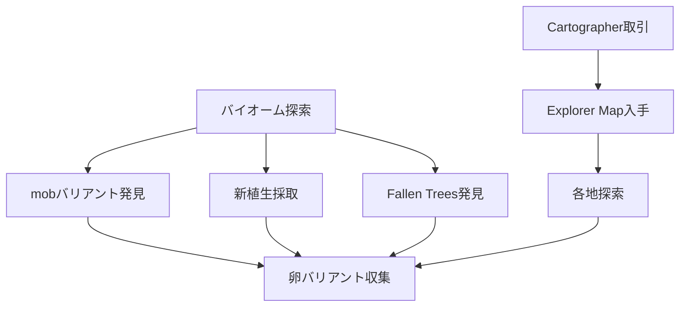

## 概要

- アップデートは Java 1.21.5 / BE 1.21.70 である。
- 主な新要素は温暖/寒冷バリアント（豚・牛・鶏）、新植生（Bush、Firefly Bush、Leaf Litter、Wildflowers）、Fallen Trees、新 Explorer Maps、卵の色バリアント、環境音である。

フロー

1. **各バイオームで mob バリアントを確認する**
   - 豚・牛・鶏の温暖/寒冷バリアントを探すとよい。
2. **新植生を発見し採取する**
   - Bush、Firefly Bush、Leaf Litter、Wildflowers を各地で採取できる。
3. **Fallen Trees を探索する**
   - 森林や平原などで倒木を発見できる。
4. **新 Explorer Map で探索を体系化する**
   - Cartographer と取引し、新しい村やジャングル、スワンプ等のマップを入手できる。
   - マップを使って各地を探索できる。
5. **卵の色バリアントを収集する**
   - 鶏から産まれる卵の色違いを集めることができる。

## 進行チャート

## 注意点・補足

## 参考

---

### 【新要素詳細】動物バリアント・新植生

#### 動物バリアント（豚・牛・鶏）

このアップデートで、豚・牛・鶏に「温暖」「寒冷」「通常」のバリアントが追加された。

- 温暖バリアントはサバンナ、ジャングル、砂漠、バッドランズ等の暖かいバイオームで自然スポーンする。
- 寒冷バリアントは雪原、タイガ、凍った海などの寒いバイオームで自然スポーンする。
- 通常バリアントはそれ以外のバイオームで自然スポーンする。
  繁殖時は親のいずれかのバリアントがランダムで生まれる。

#### 新植生

- Bush は平原や森林などに生成され、装飾用である。
- Firefly Bush は沼地や川沿いに生成され、夜間や暗所でホタルの粒子が発生する。
- Leaf Litter は森やダークフォレスト等に生成され、葉ブロックを精錬しても入手できる。
- Wildflowers は草原や森林などに生成され、ピンクペタルのように設置できる。
- Cactus Flower はサボテンの上に生成され、ピンクの染料にクラフトできる。

#### Fallen Trees

オーク、スプルース、シラカバ、ジャングルの倒木が新たに生成されるようになった。

#### Explorer Map

村人の製図家から新たな地図（村、Jungle、Swamp 等）が購入可能になった。

詳しくは [Minecraft Wiki: Spring to Life](https://minecraft.wiki/w/Spring_to_Life) を参照するとよい。
