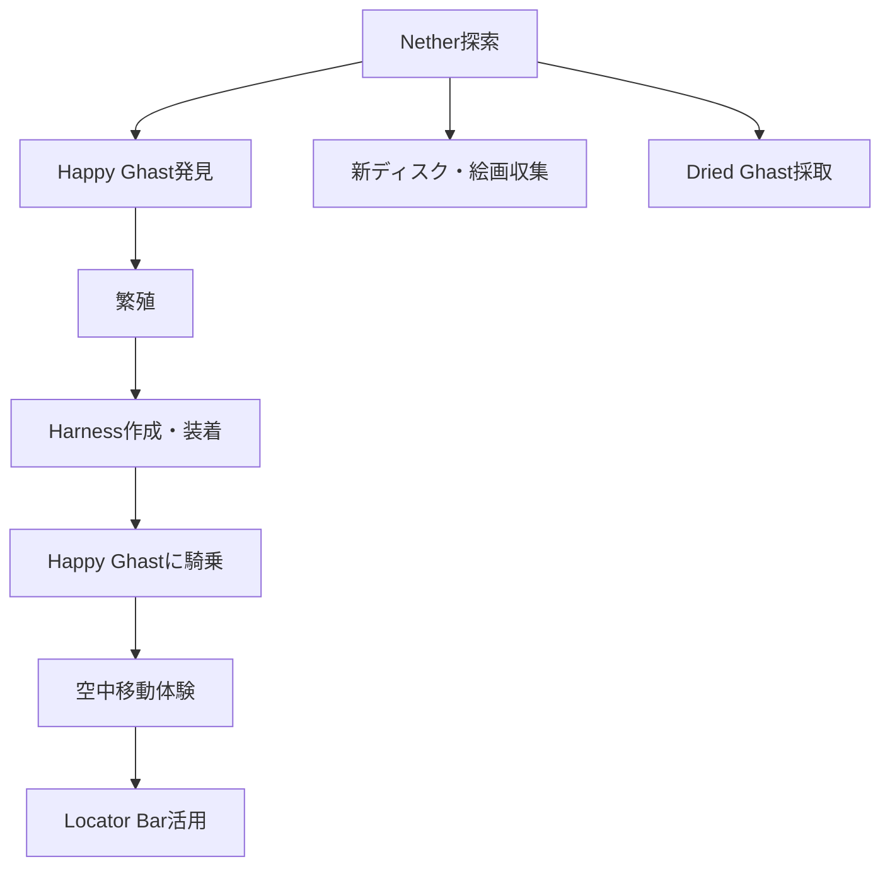

## 概要

- アップデートは Java 1.21.6 / BE 1.21.90 である。
- 主な新要素は Happy Ghast（乗れる ghast）、Harness、Ghastling、Dried Ghast、Locator Bar、新音楽ディスク、新絵画である。

フロー

1. **Happy Ghast を生成し、繁殖・装備する**
   - Nether で Happy Ghast を発見し、繁殖できる。
   - Harness をクラフトし、Happy Ghast に装着できる。
2. **Happy Ghast に乗る**
   - Harness 装着後、Happy Ghast に騎乗して空中移動を体験できる。
3. **Locator Bar を使って協調プレイする**
   - Locator Bar を有効化し、他プレイヤーの方向を確認できる。
4. **新音楽ディスクや絵画を収集する**
   - 新ディスク（"Tears"、"Lava Chicken"等）や絵画"Dennis"を集めることができる。
5. **Dried Ghast ブロックを入手する**
   - Nether で Dried Ghast ブロックを採取できる。

## 進行チャート

## 注意点・補足

- Happy Ghast は Nether でのみ出現する。

## 参考

---

### 【新要素詳細】Happy Ghast・関連アイテム

#### Happy Ghast

Happy Ghast は、1.21 アップデートで追加された新たなガストのバリアントである。

- 出現場所は Nether バイオームである。
- 特徴はプレイヤーが騎乗可能な点であり、Harness（ハーネス）を装着することで操作できる。
- 繁殖は特定の餌（例：ガストの涙など）で可能である。
- 子供（Ghastling）は成長後に騎乗できる。

#### Harness（ハーネス）

Happy Ghast に装着することで騎乗・操作が可能になる専用アイテムである。
クラフトにはレザーや新素材が必要である。

#### Dried Ghast

Nether で生成される新ブロックであり、建材や装飾に利用できる。

#### Locator Bar

複数人プレイ時、他プレイヤーの方向を画面上部に表示する新 UI である。
設定で有効化が必要である。

詳しくは [Minecraft Wiki: Ghast](https://minecraft.wiki/w/Ghast) を参照するとよい。
