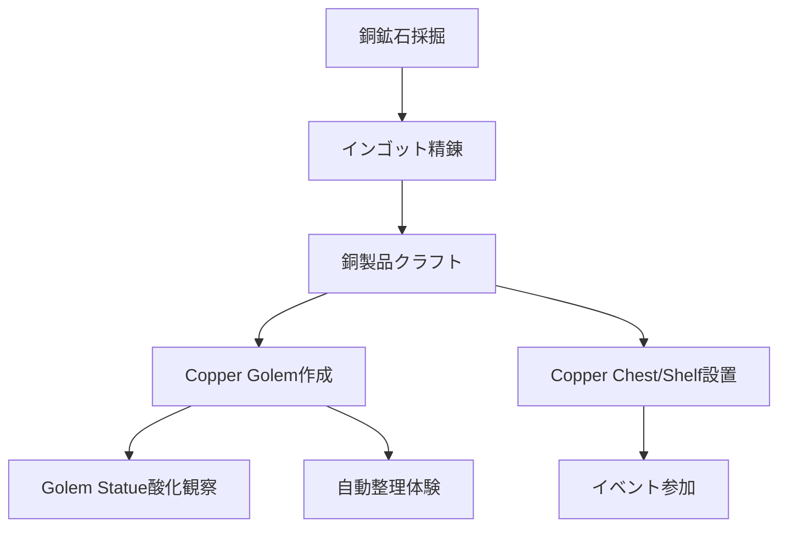

## 概要

- アップデートは Java 1.21.9 / BE 1.21.111 である。
- 主な新要素は Copper Tools/Weapons/Armor、Copper Nugget、Copper Chest、Copper Bars、Copper Chain、Copper Lantern/torch、Shelf ブロック、Copper Golem、Copper Golem Statue である。

フロー

1. **銅を大量に採掘する**
   - 地下で銅鉱石を採掘できる。
2. **銅製品を作成する**
   - Copper Tools/Weapons/Armor、Copper Chest、Shelf 等をクラフトできる。
3. **Copper Golem を構築する**
   - Copper Block 等で Copper Golem を作成できる。
   - Golem Statue の酸化変化を観察できる。
4. **自動整理やイベントを体験する**
   - Copper Golem によるチェスト整理や Copper Collection イベントを体験できる。

## 進行チャート

## 注意点・補足

## 参考

---

### 【新要素詳細】Copper Golem・銅製品

#### Copper Golem

Copper Golem は、銅ブロック等で作成できる新たなゴーレムである。

- 作成方法は Copper Block、Lightning Rod、Copper Button 等を T 字型に設置し、ボタンを押すと生成できる。
- 特徴は自律的に動き回り、Copper Chest 等の整理や Redstone 信号の発生など多機能である。
- 酸化は時間経過で進行し、見た目が変化する。ワックスで保護できる。

#### 銅製品

- Copper Tools/Weapons/Armor は鉄と同等の性能を持つ新装備である。
- Copper Chest は大容量チェストである。
- Copper Shelf はアイテム展示用ブロックである。
- Copper Lantern/torch は新たな照明である。

詳しくは [Minecraft Wiki: Copper Golem](https://minecraft.wiki/w/Copper_Golem) および [Copper](https://minecraft.wiki/w/Copper) を参照するとよい。
