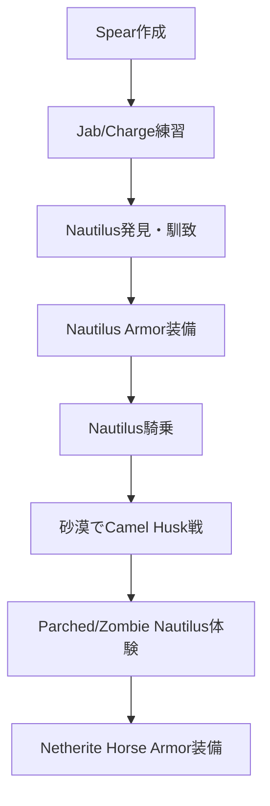

## 概要

- アップデートは Java 1.21.11 / BE 1.21.130 である。
- 主な新要素は Spear（jab/charge 武器）、Nautilus（乗れる海洋マウント）、Nautilus Armor、Netherite Horse Armor、Spear 専用エンチャント（Lunge）、Camel Husk、Parched、Zombie Nautilus、Zombie Horse である。

フロー

1. **Spear を作成し練習する**
   - 新レシピで Spear をクラフトできる。
   - Jab/Charge 攻撃を練習できる。
2. **Nautilus を馴致し乗る**
   - Nautilus を発見し、馴致して騎乗できる。
   - Nautilus Armor を装備できる。
3. **砂漠で Camel Husk と戦う**
   - 砂漠で Camel Husk や Parched と遭遇し、戦闘を体験できる。
4. **乗り物系ギミックを確認する**
   - Zombie Nautilus や Zombie Horse などの新マウントを体験できる。
   - Netherite Horse Armor を装備できる。

## 進行チャート

## 注意点・補足

- Spear は新素材でクラフトでき、Lunge エンチャントで強化できる。
- Nautilus は水中移動に特化し、Armor 装備で性能が向上する。

## 参考

---

### 【新要素詳細】Spear・Nautilus・新マウント

#### Spear（スピア）

新たな近接武器であり、Jab（通常攻撃）と Charge（溜め攻撃）の 2 種の攻撃が可能である。

- クラフトは新素材を用いて作成できる。
- Lunge エンチャントは溜め攻撃時に前方へ大きく飛び込む特殊効果である。

#### Nautilus（ノーチラス）

水中で騎乗できる新マウントである。

- 馴致は餌やしつけで騎乗可能になる。
- Nautilus Armor は専用防具で性能が向上する。
- Breath of the Nautilus は水中呼吸バーが凍結し、長時間潜水できる。

#### Camel Husk/Parched

砂漠バイオームで出現する新 Mob であり、戦闘やドロップアイテムに特徴がある。

#### Zombie Nautilus/Zombie Horse

アンデッド系の新マウントであり、特殊な条件で出現する。

詳しくは [Minecraft Wiki: Nautilus](https://minecraft.wiki/w/Nautilus) および [Spear](https://minecraft.wiki/w/Spear) を参照するとよい。
